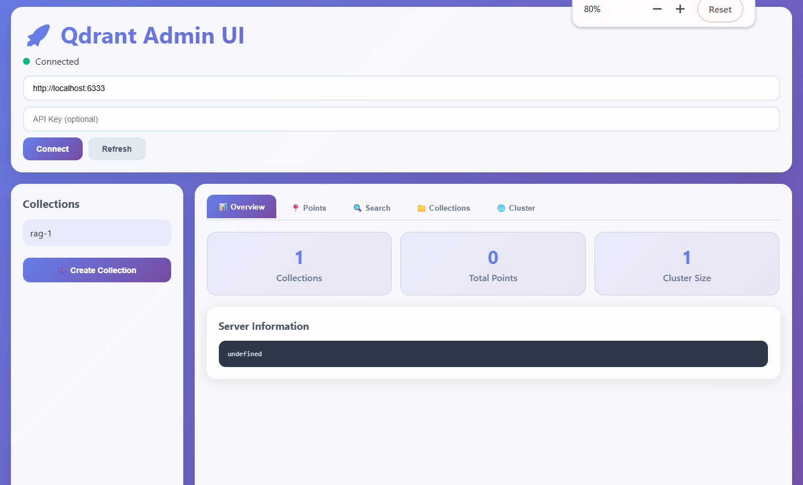

# 🚀 Qdrant Admin UI - Complete Vector Database Management Interface

[](https://opensource.org/licenses/MIT)
[](https://qdrant.tech/)
[](https://developer.mozilla.org/en-US/docs/Web/JavaScript)
[](https://developer.mozilla.org/en-US/docs/Web/Guide/HTML/HTML5)
[](https://developer.mozilla.org/en-US/docs/Web/CSS)

A **beautiful, modern, and feature-rich web-based administration interface** for Qdrant vector database. Think of it as **"pgAdmin for Qdrant"** - providing comprehensive vector database management, collection operations, point management, and advanced vector search capabilities through an intuitive web interface.

## 🌟 Why Choose Qdrant Admin UI?

- **Zero Installation Required** - Single HTML file, runs in any modern browser
- **Complete Feature Set** - All essential Qdrant operations in one place  
- **Modern Design** - Beautiful glassmorphism UI with smooth animations
- **Mobile Responsive** - Works perfectly on desktop, tablet, and mobile devices
- **Real-time Updates** - Live connection status and auto-refresh capabilities
- **Developer Friendly** - Clean code, well-documented, easy to customize



## ✨ Key Features

### 🔗 **Connection Management**
- **One-Click Connection** to local and remote Qdrant instances
- **API Key Authentication** support for secure connections
- **Real-time Connection Status** with visual indicators
- **Auto-reconnect** functionality for stable connections

### 📁 **Collection Management**
- **Create Collections** with custom vector dimensions and distance metrics
- **View Collection Details** including status, point count, and configuration
- **Delete Collections** with safety confirmations
- **Collection Health Monitoring** with real-time status updates

### 📍 **Point Operations**
- **Add New Points** with vectors and rich JSON payloads
- **Browse Existing Points** with pagination and detailed view
- **Bulk Point Operations** - delete multiple points with filters
- **JSON Payload Editor** with syntax highlighting and validation

### 🔍 **Advanced Vector Search**
- **Similarity Search** with custom query vectors
- **Advanced Filtering** using Qdrant's powerful filter syntax
- **Search Result Analysis** with similarity scores and detailed metadata
- **Configurable Parameters** - limit, score threshold, payload options

### 📊 **Monitoring & Analytics**
- **Real-time Statistics** - collections count, total points, cluster size
- **Server Information** display with detailed system metrics  
- **Cluster Management** for distributed Qdrant deployments
- **Performance Monitoring** with connection health checks

### 🎨 **User Experience**
- **Modern Glassmorphism Design** with gradient backgrounds
- **Smooth Animations** and micro-interactions
- **Responsive Grid Layouts** that adapt to any screen size
- **Dark Mode Code Viewers** for JSON data inspection
- **Keyboard Shortcuts** for power users (Ctrl+R, Ctrl+N, etc.)

## 🚀 Quick Start

### Prerequisites
- **Qdrant Server** running (local or remote)
- **Modern Web Browser** (Chrome, Firefox, Safari, Edge)

### Installation Methods

## 🌍 Live Preview (GitHub Pages)

> 🧪 View the live demo (static UI only):
[https://imadfaouzi.github.io/QdrantUI](https://imadfaouzi.github.io/QdrantUI)

---

## 📦 Quick Start

### 🔄 Clone the repository

```bash
git clone https://github.com/imadfaouzi/QdrantUI.git
cd QdrantUI
```

### 🧭 Open in your browser

```bash
# Simply open the file in your browser
open index.html     # macOS
start index.html    # Windows
xdg-open index.html # Linux
```

---

## 🛠️ Customization

This project is completely static and uses **no build tools**. You can:

- Point the API URLs in the JavaScript to your own Qdrant instance
- Add authentication headers if needed
- Style or theme the UI easily with vanilla CSS

---

## 📁 Project Structure

```bash
QdrantUI/
├── index.html        # Main UI entry point
├── styles.css        # UI styling (optional)
├── script.js         # Logic and API interaction
└── README.md         # This file
```

> ⚠️ This project is framework-free. No React, Vue, Angular, or bundlers.

---

## 💬 Feedback & Contributions

We welcome suggestions, improvements, and contributions!  
Feel free to open issues or submit pull requests.

---

## 📚 About Qdrant

> [Qdrant](https://qdrant.tech/) is an open-source vector search engine optimized for the next generation of AI applications.

This project is an unofficial frontend tool to simplify Qdrant usage visually.

---

## 📜 License

MIT © [Imad Faouzi](https://github.com/imadfaouzi)

---

### 🔎 Keywords (SEO)

`qdrant ui`, `qdrant dashboard`, `qdrant frontend`, `vector database ui`, `html qdrant`, `javascript qdrant api`, `open source qdrant interface`, `lightweight vector db ui`, `qdrant viewer`, `qdrant json viewer`, `qdrant web`


## 🔧 Configuration

### Connection Settings
- **Default URL**: `http://localhost:6333` (perfect for local development)
- **API Key**: Optional, leave empty for local instances
- **Custom Endpoints**: Support for remote Qdrant clusters

### Supported Qdrant Versions
- ✅ **Qdrant v1.9.2+** (Recommended)
- ✅ **Qdrant v1.8.x** (Partial support)
- ✅ **Qdrant v1.7.x** (Basic operations)

## 📖 Usage Guide

### 1. **Connect to Qdrant**
```
1. Open qdrant-admin.html in your browser
2. Enter your Qdrant server URL (default: http://localhost:6333)
3. Add API key if required
4. Click "Connect"
```

### 2. **Create Your First Collection**
```
1. Click "Create Collection" button
2. Enter collection name (e.g., "my_vectors")
3. Set vector dimension (e.g., 384 for sentence transformers)
4. Choose distance metric (Cosine, Euclidean, Dot Product)
5. Click "Create"
```

### 3. **Add Vector Points**
```
1. Select a collection from the sidebar
2. Go to "Points" tab
3. Click "Add Point"
4. Enter vector data: [0.1, 0.2, 0.3, ...]
5. Add metadata payload: {"category": "example"}
6. Click "Add"
```

### 4. **Perform Vector Search**
```
1. Go to "Search" tab
2. Enter query vector: [0.15, 0.25, 0.35, ...]
3. Set search limit and filters
4. Click "Search"
5. Analyze results with similarity scores
```

## 🎯 Use Cases

### **AI/ML Development**
- **Vector Embeddings Management** for NLP models
- **Similarity Search Testing** during model development
- **Dataset Exploration** and vector analysis
- **Model Performance Evaluation** with search metrics

### **Production Operations**
- **Database Health Monitoring** for production Qdrant clusters
- **Data Migration Tools** for moving vector collections
- **Troubleshooting Interface** for investigating search issues
- **Administrative Tasks** like bulk operations and cleanup

### **Research & Prototyping**
- **Rapid Prototyping** of vector search applications
- **Data Science Workflows** with interactive vector exploration
- **Educational Tool** for learning vector databases
- **Benchmark Testing** with custom search parameters

## 🔧 Advanced Configuration


## 📈 Roadmap

### **Upcoming Features**
- [ ] **Advanced Analytics Dashboard** with vector statistics
- [ ] **Import/Export Tools** for vector data migration
- [ ] **Query Builder** with visual filter construction
- [ ] **Performance Profiler** for search optimization
- [ ] **Multi-tenancy Support** for enterprise deployments
- [ ] **Plugin System** for custom extensions

### **Long-term Goals**
- [ ] **Desktop App** with Electron wrapper
- [ ] **Mobile App** for iOS and Android
- [ ] **Enterprise Features** with RBAC and audit logs
- [ ] **Integration APIs** for CI/CD pipelines

---

<div align="center">

**⭐ Star this repository if you find it useful!**

**Made with ❤️ for the Vector Database Community**


</div>
